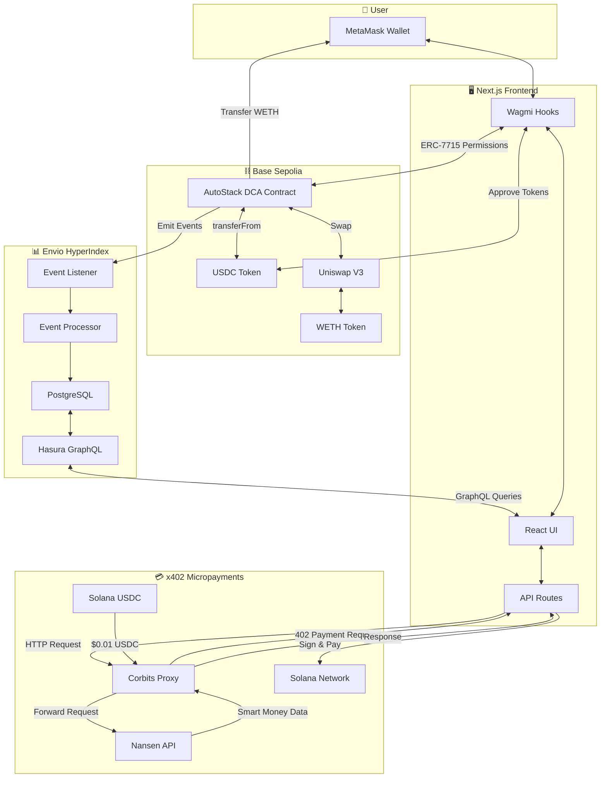
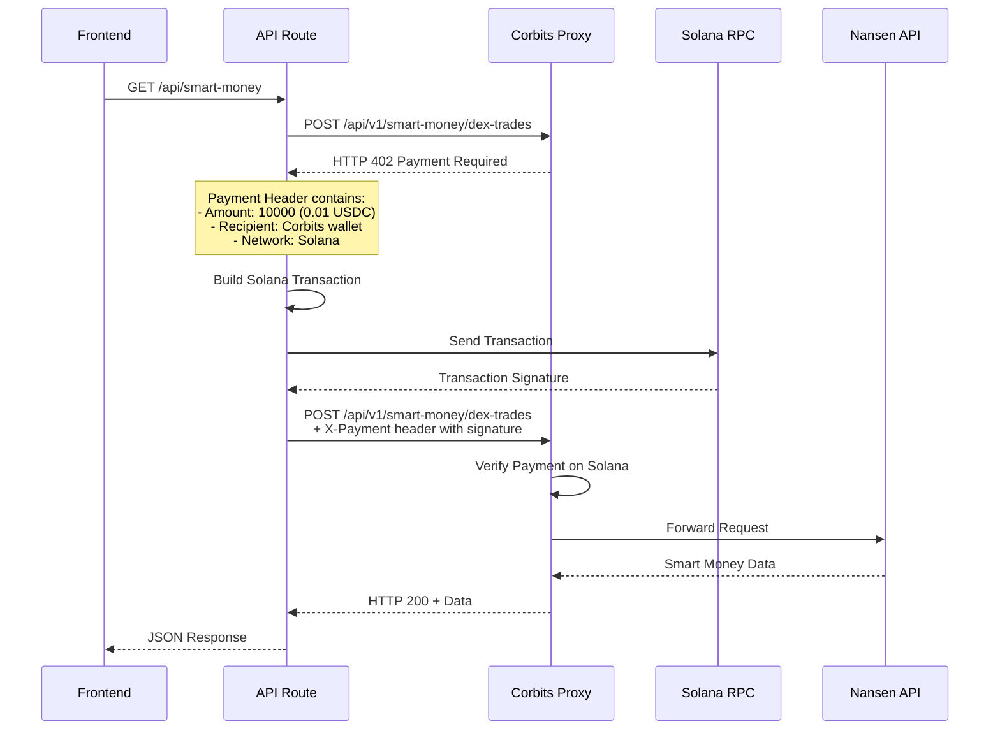
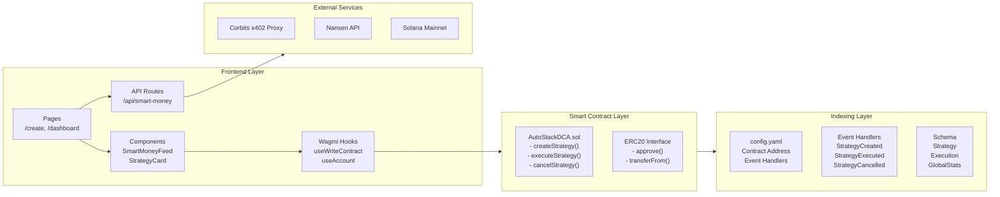
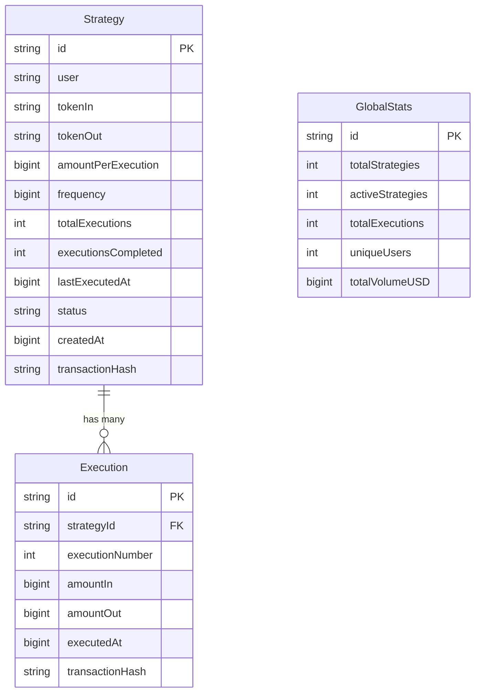
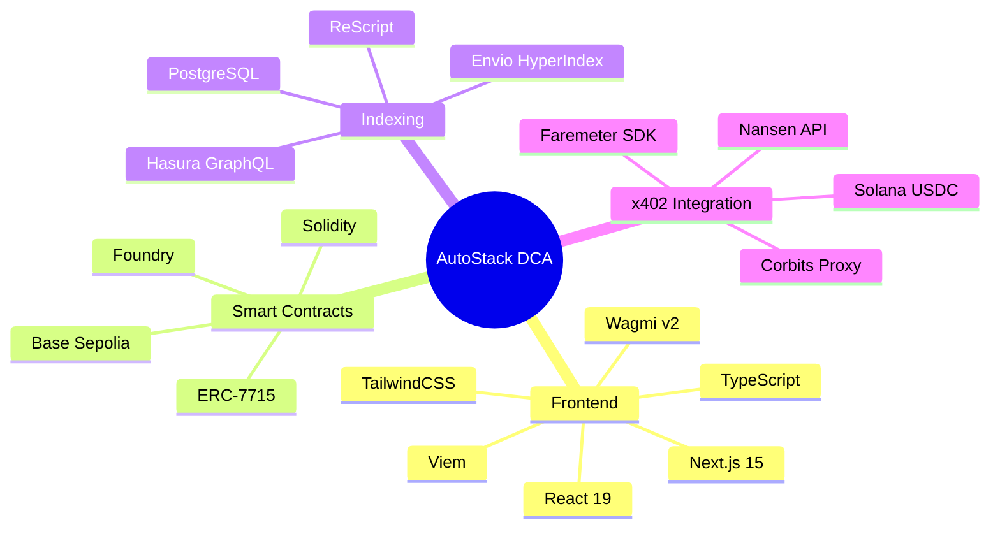

# AutoStack DCA - Architecture

## System Overview



## DCA Strategy Flow

```mermaid
sequenceDiagram
    participant U as User Wallet
    participant F as Frontend
    participant C as DCA Contract
    participant T as USDC Token
    participant X as Uniswap V3
    participant E as Envio Indexer

    Note over U,E: Strategy Creation
    U->>F: Connect Wallet
    F->>T: approve(contract, amount)
    U->>T: Sign Approval
    T-->>F: Approval Confirmed
    F->>C: createStrategy(tokenIn, tokenOut, amount, frequency, executions)
    U->>C: Sign Transaction
    C->>C: Store Strategy
    C-->>E: Emit StrategyCreated Event
    E-->>F: Real-time Update

    Note over U,E: Strategy Execution (Daily)
    rect rgb(40, 40, 60)
        C->>T: transferFrom(user, contract, amount)
        T-->>C: USDC Transferred
        C->>X: exactInputSingle(USDC → WETH)
        X-->>C: WETH Received
        C->>U: transfer(WETH)
        C-->>E: Emit StrategyExecuted Event
        E-->>F: Real-time Update
    end

    Note over U,E: Funds flow: User → Contract → Uniswap → User
```



## x402 Payment Flow



## Component Architecture



## Data Models



## Technology Stack



## Key Innovation Points

### 1. ERC-7715 Non-Custodial Permissions
```
Traditional DCA:  User → Deposit to Vault → Vault Executes → User Withdraws
AutoStack DCA:    User → Grant Permission → Contract Pulls on Execute → Direct to User
```

### 2. Envio Real-Time Indexing
```
Traditional:  Block Mined → Wait 1-5 min → Index → Query → UI Update
Envio:        Block Mined → <1 sec → Index → GraphQL Push → UI Update
```

### 3. x402 Micropayments
```
Traditional API:  Sign Up → KYC → Pay $200/month → Get API Key → Make Requests
x402 Protocol:    Make Request → Pay $0.01 → Get Data (No account needed)
```
